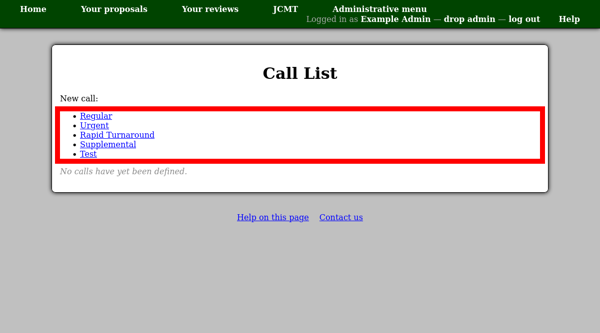
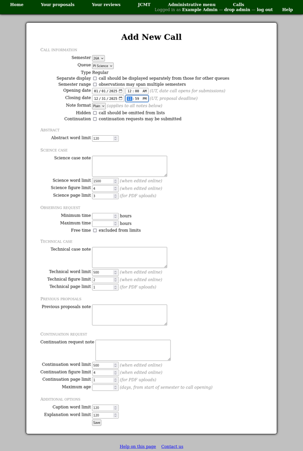
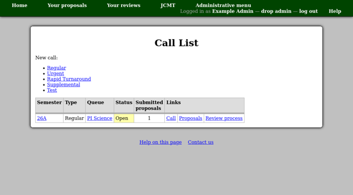
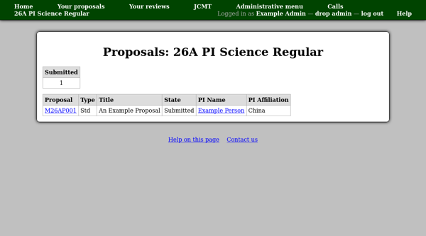
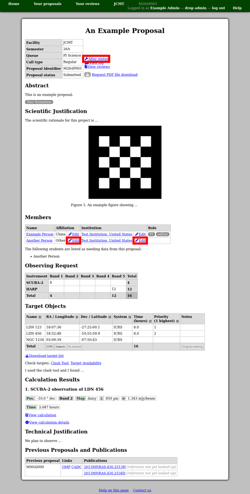
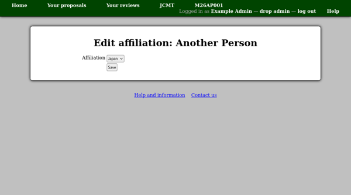
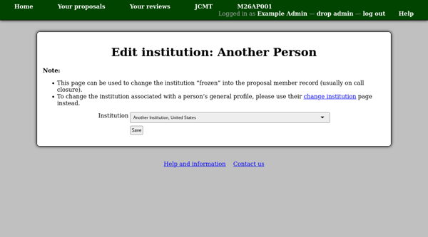
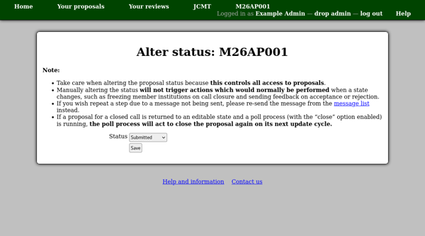

Creating a Call for Proposals
=============================

When you have prepared a semester and queue, you can combine them
to open a call for proposals.
From the facility administrative menu, select "Calls".
At the top of the call list page, you will find a list
showing the different types of calls for proposals which
you can open.
Click the link for the type you wish to use.

Select the semster and queue at the top of the page and enter
the range of dates when you want the call for proposals to be
available.  If the opening date is in the future, then the call
will be hidden until that date.

This page also allows you to configure the word, figure and page limits
for various parts of the proposal.
If, for a given part, both a word limit and a PDF page limit are
specified, proposal authors will have the choice of either
entering text online or uploading a PDF file.
If one of the limits is set to zero, only the other choice
will be available.

The "technical case note" and "science case note" will be shown
on the page where people will edit the corresponding part of their
proposal.  Therefore you can use these notes to indicate what is
expected in each part.  You may wish to include:

* Elements you wish people to include in their proposal.

* Additional constraints, such as the number of pages of text and
  figures when PDF files are uploaded.

The "Calls" page will then show a table of calls,
indicating the status of each and giving links to
pages about the call:

View call
    Takes you to the administrative interface for the call itself.
    From here you can edit the call or go to the list of proposals.

View proposals
    Takes you to a list of all proposals for the call.

Review process
    Takes you to the review process page for the call.
    This page is also accessible directly from the facility
    home page.

You can use the proposals page to navigate to any proposal
which has been created for this call.
A summary at the top of this page also indicates how many
proposals are in each state.

When viewing a proposal, you can edit the member affiliation
or institution if this information
has been entered incorrectly
or manually change the status of the proposal.
To do this use the link next to the current affiliation or status.

Editing an affiliation will show a new page where you can enter the correct
affiliation for the proposal member in question.

Editing an institution shows a new page where the institution saved for
the member for this proposal in particular can be corrected.
Normally this information is only saved when a call for proposals closes,
or when the proposal is submitted in the case of immediate / urgent calls.
This page is best used after this has happened to allow any subsequent
updates to the person's institution to apply automatically.
You can also edit the general institution for the member
from their :doc:`person profile page <user>`.

Altering the proposal status also shows a new page where any proposal state
can be selected.
This should normally only be done in exceptional circumstances.
Please read the notes on the alter status page itself before proceeding.

