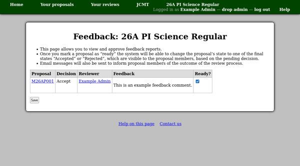

Sending Feedback and Thanks
===========================

Sending Proposal Feedback
-------------------------

Once the committee reviewers have entered feedback for each proposal,
you will be able to use the "Approve feedback reports" page to view the
comments which have been entered.
When you approve them, the system will be able to send a feedback message
to the proposal members.
Once the feedback message has been sent, the proposal will
be set to its final "Accepted" or "Rejected" state.
Members of the proposal will be able to log into the system,
see the proposal status and read the feedback online.

Thanking Invited Reviewers
--------------------------

Once invited reviewers have completed their reviews,
the "Assign reviewers" page will show a link allowing you to
send each of them a "thank you" message.

This link leads to a page listing the reviewers who have not yet
been thanked.  Here you can confirm sending messages to them.

