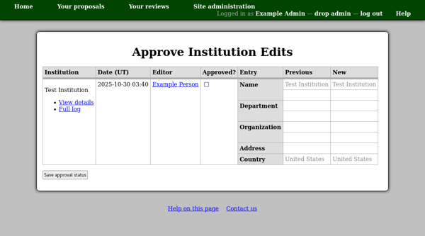
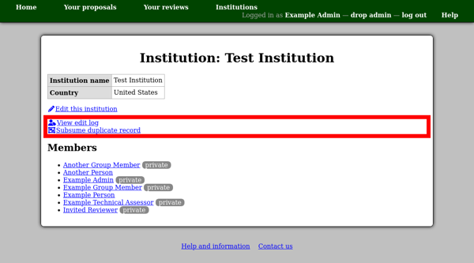
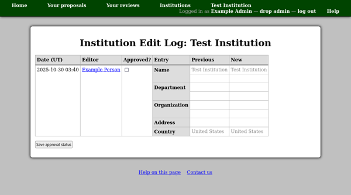
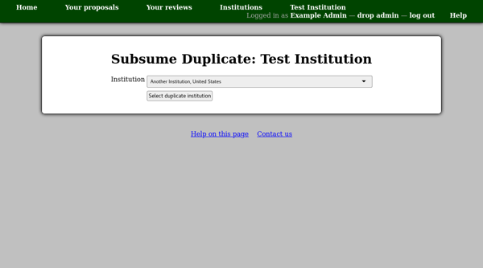
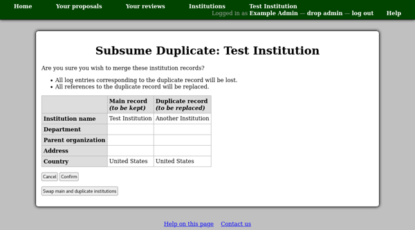

Institution Edits
=================

Since there is a single collection of institution database
records shared amongst all users of the system,
it is important to keep an eye on edits made to these records.
This is because if a user make an inappropriate edit
to an institution record
(such as 'recycling' it to represent a different institution)
then the change will effect all members of the institution.

The institution edit approval page lists institutions for which
there are edits which have not yet been approved.
You can use the check box for each edit to select it for
approval and then use the "Save approval status" button
to store this information in the database.

To view the edit history for an individual institution,
either use the "Full log" link on this page,
or the "View edit log" link on the institution page.

This shows all edits for the given institution.

If you need to merge institution records,
for example if two users added the same institution to the database,
then you can use the
"Subsume duplicate record"
link to merge another institution into the currently displayed institution.

The first page allows you to select the duplicate institution.

Then you will see a confirmation page giving the details of the
two institutions.
Please use this page to check that the two records do indeed
refer to the same institution,
and that the most suitable record is the one being kept.

