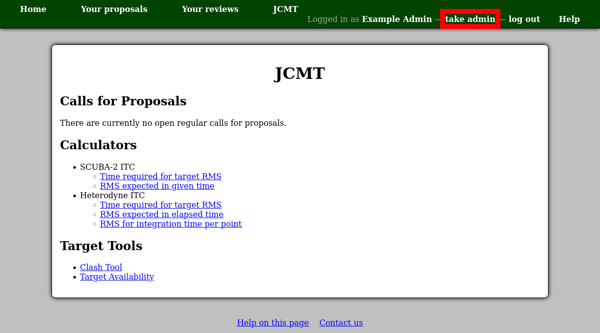
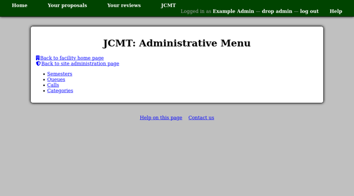

The Administrative Menu
=======================

When you are logged in with an account which has permission to take
administrative privileges, you will see a link labeled
"take admin" next to the "log out" link.

Clicking this link will temporarily grant you administrative
privileges.  Note that the link changes to "drop admin" ---
you should click this when you are done with your administrative
tasks.

In this state, you are still logged into the system as yourself,
but extra capabilities will be made available.  You may see
extra links, such as the "Administrative menu" link on a
facility home page.

.. image:: image/facility_home_admin.png

This menu gives access to a number of pages which will allow
you to manage calls for proposals for the facility.

