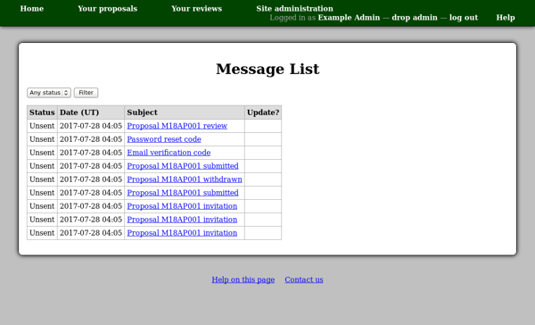

Email Messages
==============

The email messages page allows you to see all of the messages
which are stored in the system's database.
Messages are initially written just into this database,
for subsequent sending by a background poll process.

This page therefore allows you to check for problems with the
background sending of email messages, as well as to inspect
and retrieve information from the messages themselves as required.

You can use the filter control at the top of the page to select
which messages to include.

To view messages sent to a particular person,
you can use the "View messages" link on their profile page.
