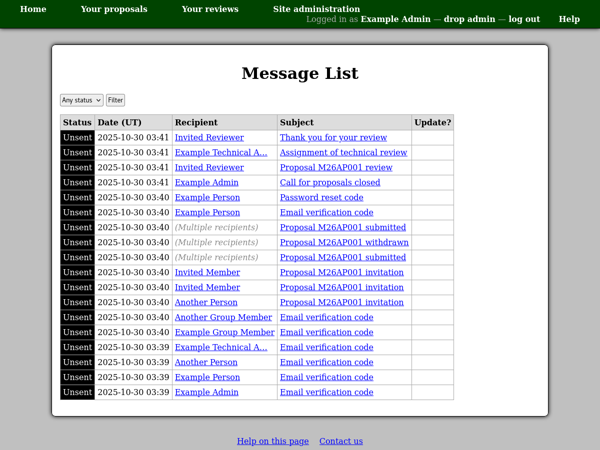
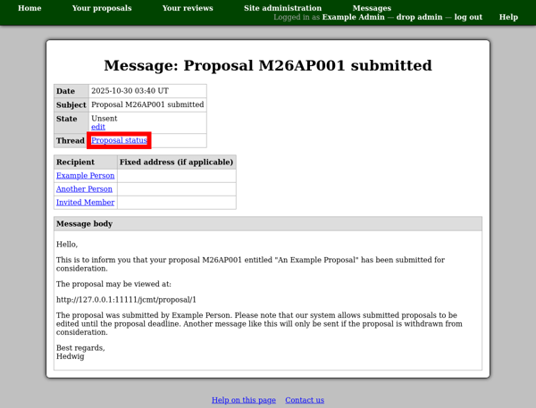
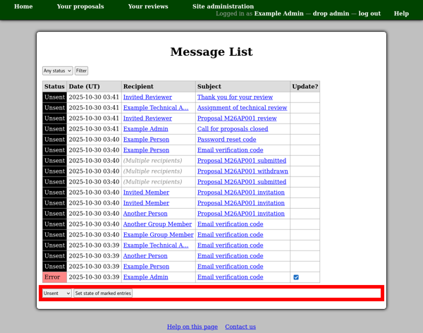

Email Messages
==============

The email messages page allows you to see all of the messages
which are stored in the system's database.
Messages are initially written just into this database,
for subsequent sending by a background poll process.

This page therefore allows you to check for problems with the
background sending of email messages, as well as to inspect
and retrieve information from the messages themselves as required.

You can use the filter control at the top of the page to select
which messages to include.

To view messages sent to a particular person,
you can use the "View messages" link on their profile page.

Viewing Messages
----------------

You can click a message subject to view an individual email
message.
If the message has been sent then you will see the date at which
sending started and finished along with the message identifier
at the top of the page.

Most messages are simply addressed to one or more people
and you will see their names in the recipients table.
When the message is sent, it will go to each person's
primary email address.
However some types of messages, such as email address verification codes,
must be sent to a particular email address.
For these messages you will see an email address listed in the
"fixed address" column of the recipients table.

Sometimes messages are grouped into threads.
In this case you will see an entry at the top of the page
identifying which type of thread the message belongs to.
You can click this link to see all the messages in the thread.

Updating Message Status
-----------------------

When a message is in an active state (e.g. sending)
a checkbox will be displayed in the "Update?" column.
If you think that the message has become stuck in this
state, you can select the box and then use the form
at the bottom of the page to reset it.
Here you can choose whether to return the message to the
unsent state, so that the system tries to send it again,
or to discard it.

