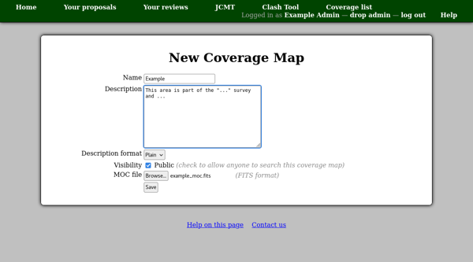

Clash Tool Coverage
===================

The "Clash Tool" is a utility which can be used to check observing
targets for intersections with pre-defined areas of the sky.
These areas are specified by uploading MOC files (in FITS format).

To start the process, select "Clash tool coverage" from the facility
administrative menu and then click "New coverage map".
You can then enter the name and a description as well as selecting the
file to upload.
The name will be displayed when someone searches for matches
as a link to a detail page showing the description.
It is therefore a good idea to make the name short but meaningful
so that people can see what type of match they have found.
The description can be used to give more details on how the
clash area has been defined and what should be done if matches
are found.

Example types of MOC files are:

* Areas protected by survey projects.  The description might
  include notes indicating under what circumstances observations
  in the region are prohibited.

* Areas already observed by the observatory.  If these are loosely
  defined (e.g. everything observed by a particular heterodyne
  instrument) the description might suggest searching the facility's
  archive for the particular type of observation being
  planned (e.g. the specific molecular transition).

