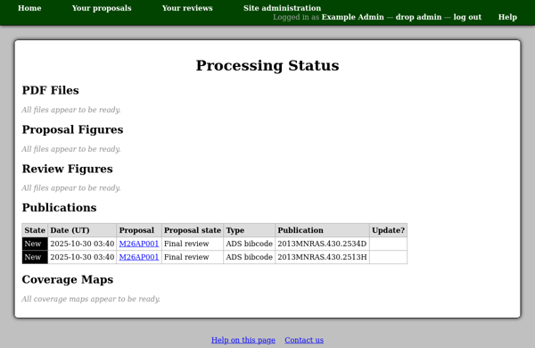

Processing Status
=================

Various background tasks are performed by background poll processes.
Aside from email message sending,
described on the :doc:`email messages list <messages>` page,
these include:

* Processing uploaded PDF files.
* Processing uploaded figures.
* Looking up publication references.
* Storing clash tool coverage maps.

The processing status page shows the status of these processing tasks,
for entries which are not "ready".
You will see entries in one of the following states:

New
    The entry has not yet been processed.

    If the entry persists in this state, you should check that the
    background poll process is still running.

Processing
    A background process started working on this entry.

    It would be possible for an entry to become stuck in this
    state if the background poll process was forced to exit
    while processing it.

Error
    The system failed to process this entry.

    The poll process log may have more information as to what went wrong.

(Entries in the "Ready" state are not shown in the listing.)

When there are entries in the "Processing" or "Error" state,
there will be a check box in the "Reset?" column of the table.
You can use these to select entries for which you would like
the system to try again,
and then press the "Reset marked entries" button at the bottom of the page.
