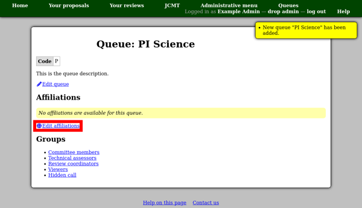

Managing Queues
===============

Each facility can have a number of "queues" to which applicants may
submit proposals.
You need only set up the queues once --- each call for proposals can
refer to the same set of queues.
This also means that editing an existing queue will potentially
alter any pages which refer to the queue, such as proposals for
previous semesters using that queue.
Therefore you should not change the queue code of an
existing queue if there are existing proposals which you do not
want to effect, instead adding a new queue with the new code
may be safer.

As for semesters, the queue can have a "name" (for display) and a "code"
(used to generate proposal codes).

The description can be used to describe the queue and explain who
is eligible to submit a proposal to it.

Once you have created a queue, you will see its information page.
At first a queue has no affiliations.
**This will prevent anyone from submitting a proposal.**
You should proceed by clicking the
"Edit affiliations" list in order to set up the list of affiliations.

The affiliations page shows a table where you can add as many rows
as you like using the "Add affiliation" button.

Each member of a proposal submitted to this queue will have to
select an affiliation from this list, so you can set the
list up however is appropriate to track proposal affiliations
for your facility.
If you allow proposals to have members who aren't associated with one
of your specific affiliations
(such as co-investigators from other countries),
you should include an entry such
as "Other" in the list to accommodate these members.

Please also read the warnings at the top of the page about
editing affiliations.
As with queues themselves, the affiliations listed here
are linked to the member list of every proposal.
In practice this means:

* If you correct the spelling of an affiliation, it will be corrected
  on every proposal with a member using that affiliation.

* If you attempt to 'recycle' an entry in the table for a new affiliation,
  every proposal using the corresponding affiliation will now have members
  with the wrong affiliation listed.  You should add a new affiliation
  and hide the old one instead.

