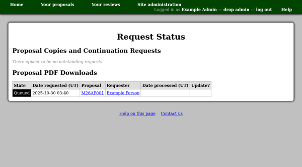

User Request Status
===================

In addition to general processing tasks,
as listed on the :doc:`processing status <processing_status>` page,
some time-consuming actions which users may request
are also performed by background poll processes.
These may include:

* Copying a proposal.
* Preparing a proposal PDF file for download.

The user request status page lists requests in active and error states.
These may include:

Queued
    The request has been received but the system has not
    yet started processing it.

Processing
    The system has started working on the request.

Error
    An error occurred while processing the request.

Expiring
    The request has expired and the system has started
    to clear up any associated resources.

Expiry error
    An error occurred during the expiry process.

When a request's status can be reset,
a check box will appear in the "Update?" column.
You can then choose a new status and press
the "Set state of marked entries" button
at the bottom of the page.
Note that only certain status transitions
can be performed through this form,
e.g. from an error in processing to "Queued"
or from an error in expiry to "Ready" so that expiry can be re-tried.
