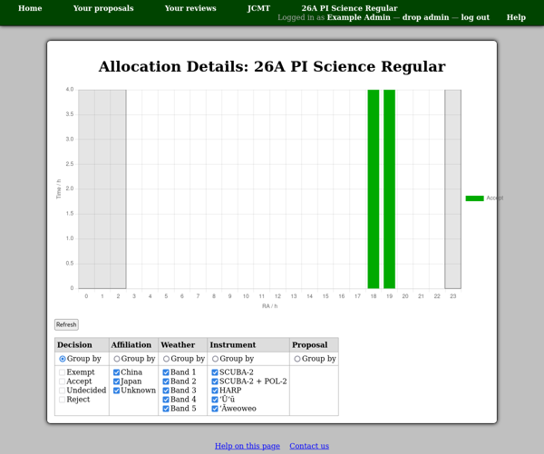

Allocation Details
==================

The allocation details page allows you to plot
the time for each proposal against its RA distribution.

The refresh button can be used to update the chart with
new acceptance decisions and total time allocations.
The category table can be used to select how to group
the data into colored data sets for plotting.
For the categories not selected for grouping,
the check boxes can be used to filter the data.
Note that the system does not record which part of
a proposal's time allocation (or request) is related
to which source, so the filtering options will
simply scale the proposal's time distribution in RA
by a suitable amount.

