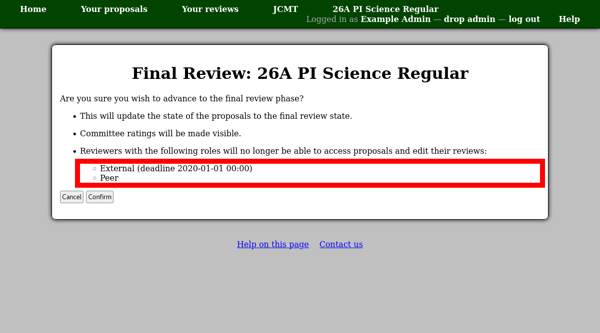

Final Review Phase
==================

The final review phase is the part of the review process where
:doc:`decisions are entered <tabulation_decision>` and
:doc:`feedback is written and sent <feedback>`.

Once the main review part of the review process is complete and you
are ready to start making decisions, you can use the
"Advance to final review phase" link on the review process page.

