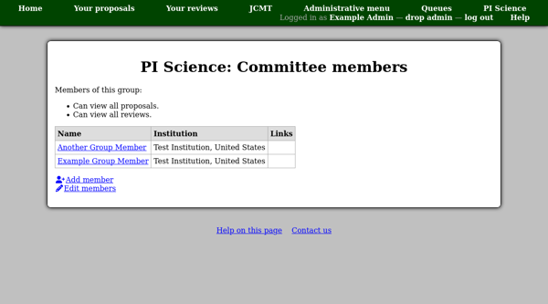
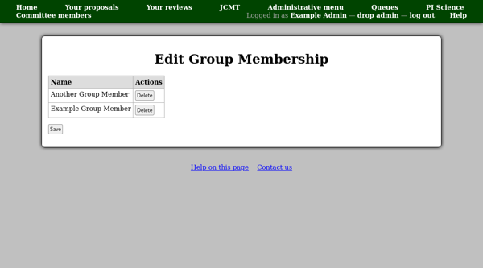

Review Groups
=============

Reviewer groups, such as technical assessors and the time allocation
committee are configured by queue.

To view or edit a group, select "Queues" from the administrative menu and then
select the relevant queue.
Then scroll down to the "Groups" section of the queue page and
select the group you wish to work with.

You will see a summary of any special access rights which members of the
group have listed at the top of the page, above the table of current
group members.

You can use the "Add member" link to add someone to the group.

* If you select them from the member directory they will be added immediately
  and will not receive an email notification.

* If you invite someone by entering their name and email address,
  then they will be sent an invitation code by email.

.. image:: image/group_cttee_add.png

You can use the "Edit members" link to edit the current group membership.
Currently the only option here is to delete members.
Your changes will only be saved when you click the "Save" button at the
bottom of the page.

Finally on the queue page, you will find a link "View all"
in the "Groups" section.
This will take you to a table showing all group members
for this queue and the corresponding groups.

.. image:: image/group_all_view.png
