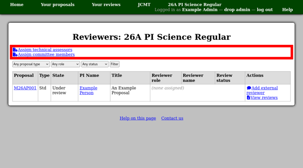

Setting up a Review Process
===========================

To get to the review process page, you can either click a
"Review process" link in the "Calls" page from the
administrative menu,
or select the review process from the list on the
facility home page.

This page shows a table with some basic information about
each proposal.
The proposal code is a link to the proposal view page
and there is also a link to a page where you can see
all the reviews of each proposal.

.. image:: image/review_process.png

Assigning Reviewers
-------------------

Clicking the "Assign reviewers" link on the review process page
takes you to another page with more detail about the assignment
of reviewers to proposals.

To invite an external reviewer, use the
"Add external reviewer" link the "Actions" column.

The next page shows a summary table of information about
the proposal, its abstract and any selected categories.
As with inviting a member to a proposal,
you can either select someone from the user directory
or enter their name and email address.
If you invite someone to register via name and email address,
please remember to select their institution on the
next page.
This will prevent the system from having to prompt them
for their institution when they accept the invitation.

In either case the person will be sent an email to inform
them that they have been invited to review the proposal.
If you did not select them from the user directory then
this message will include an invitation code which they
can use to register or add to an existing account.

.. image:: image/reviewer_external.png
