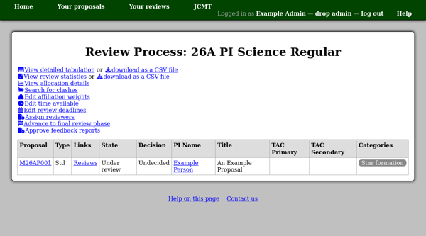
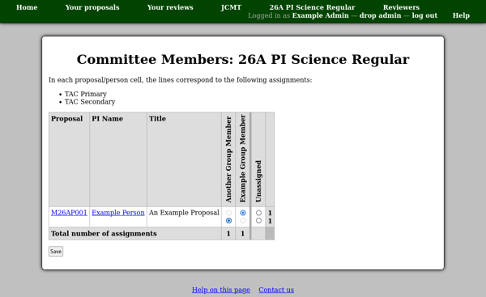
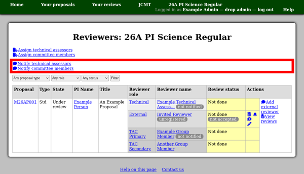
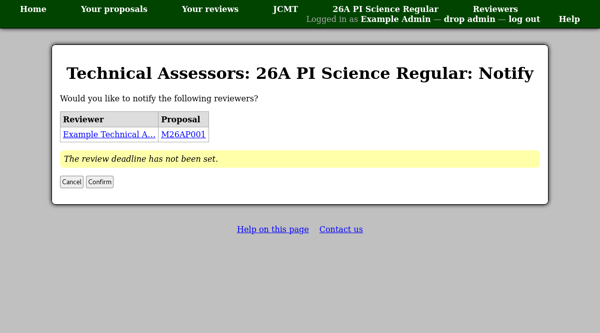

Setting up a Review Process
===========================

To get to the review process page, you can either click a
"Review process" link in the "Calls" page from the
administrative menu,
or select the review process from the list on the
facility home page.

This page shows a table with some basic information about
each proposal.
The proposal code is a link to the proposal view page
and there is also a link to a page where you can see
all the reviews of each proposal.

Assigning Reviewers
-------------------

Clicking the "Assign reviewers" link on the review process page
takes you to another page with more detail about the assignment
of reviewers to proposals.

.. image:: image/reviewer_assign.png

Technical Assessors
~~~~~~~~~~~~~~~~~~~

To assign technical assessors, use the
"Assign technical assessors" link at the top of the page.
This will show a grid where you can select the
technical assessor for each proposal.

The grid may contain elements other than selection controls:

Blank cell
    The person is a member of the proposal,
    so they can not be selected as a reviewer.

Check mark
    The person was selected as a reviewer and has
    already started their review, so the review
    can not be reassigned using this page.

Cross mark
    The person already has a review of a conflicting type.

Horizontal dash
    The reviewer role can only be assigned
    to one person and a review has already been
    submitted for it.

In addition, a colored outline might be present if people
are asked to accept reviews for this role:

Solid red
    The person rejected this reviewer role assignment.

Dashed blue
    The person accepted this assignment.

Note that these outlines are based on the log of review acceptance,
so they may contain information not present in the current status
of each review.

Committee Members
~~~~~~~~~~~~~~~~~

To assign committee members, use the
"Assign committee members" link at the top of the page.
This shows a similar grid to that for the technical assessors,
except that there are two rows of controls for each proposal.
The top row selects the primary committee reviewer
and the second row selects secondary committee reviewers.

External Reviewers
~~~~~~~~~~~~~~~~~~

To invite an external reviewer, use the
"Add external reviewer" link the "Actions" column.

The next page shows a summary table of information about
the proposal, its abstract and any selected categories.
As with inviting a member to a proposal,
you can either select someone from the user directory
or enter their name and email address.
If you invite someone to register via name and email address,
please remember to select their institution on the
next page.
This will prevent the system from having to prompt them
for their institution when they accept the invitation.

In either case the person will be sent an email to inform
them that they have been invited to review the proposal.
If you did not select them from the user directory then
this message will include an invitation code which they
can use to register or add to an existing account.

The email message will also show the review deadline,
if one has been set for external reviews on the
:doc:`review deadlines <review_deadline>` page for this
review process.
It is therefore recommended that the deadlines be
configured before external reviewers are invited.
Please check that the review deadline is shown correctly
on the reviewer add page before selecting or inviting
a reviewer.

Notifying Reviewers
-------------------

People assigned reviews via reviewer grids are not notified automatically.
This allows you to work on the assignments incrementally without generating
excess email messages.
Instead the system tracks which assigned reviewers have not
yet been sent a notification.
This status is shown in the reviewer listing.
If there are reviewers who have not yet been notified,
you will find links such as "Notify technical assessors"
at the top of the page.

Following this link takes you to a confirmation page which lists the
people to whom notifications will be sent and the corresponding proposals.
Clicking the "Confirm" button will allow the notifications to be sent out.

If you subsequently assign more reviews for the same role,
you can return to this page to send notifications for
the newly-assigned reviews.
