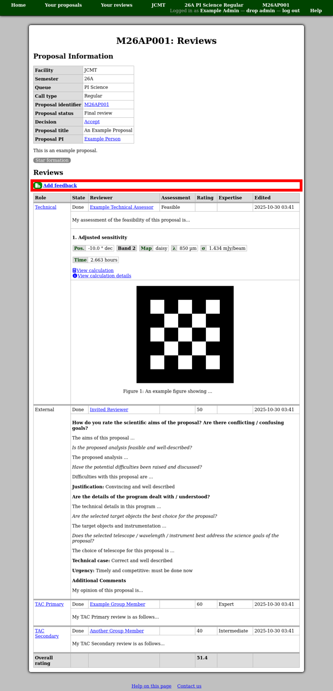

Reviews of a Proposal
=====================

You can navigate to the reviews of a proposal in several ways;

* From the review process page, click "Reviews".

* From the reviewer assignment page, click "View reviews".

* From a proposal view, when the proposal is under review,
  click "View reviews" next to the proposal status.

You should see a page with a summary information table,
proposal abstract, category list and a table showing all of the reviews.

If you are eligible to add any additional reviews of the proposal,
you will find a set of appropriate links in the middle of the page,
above the table of reviews.

