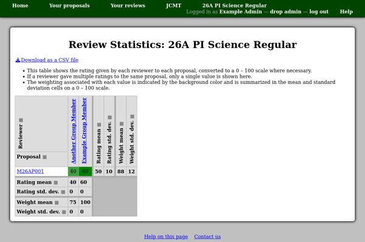

Review Statistics
=================

The review statistics page allows you to see how each reviewer
evaluated the proposals.
The table shows the ratings numerically
(converted to a 0 -- 100 scale if necessary)
with the associated weighting factor
indicated by the background color.

You can also download a copy of the same information as a CSV file,
where alternate columns give the rating and weighting factor.

