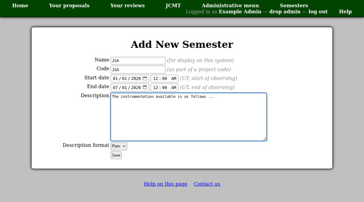

Managing Semesters
==================

The first step in setting up a call for proposals is to define the
semester to which it relates.  A semester has both a "name" and a "code".

Name
  This is the name by which the semester will commonly be known.
  It can be a longer, descriptive, name where required, e.g. in
  special semesters or if an established semester numbering scheme
  is not in place.

Code
  This is used by the system to generate proposal codes.  For example,
  at JCMT, proposals codes take the form "M15AI001" where the "M"
  denotes a regular proposal, "15A" is the semester code, "I" is the
  queue code and "001" is a proposal number.  In this case you would
  enter "15A" as the code.
  The code may often be the same as the semester name.

Next enter the observing dates of the semester.  These dates will be
used to inform users as to when the semester is and may be used in
automated target tools to help determine whether observing targets
are suitable in this semester.

The description box allows you to enter the text to be used for a call
for proposals for this semester.
You can enter plain text, which will be shown as entered
in the box, or you can select a formatting scheme.
This will allow you to add formatting such as bold text,
bullet pointed lists and links to your description.

Information you may wish to include in the description could be:

* Any news since previous calls.
* Links to useful information.
* Available instrumentation.
* Notes about the time allocation process for this call.

You will be able to enter the following information in specific places
later in the process, so for now you need not include:

* Details of available queues and eligibility for them.
* Notes on what is expected in the technical and scientific justification.

