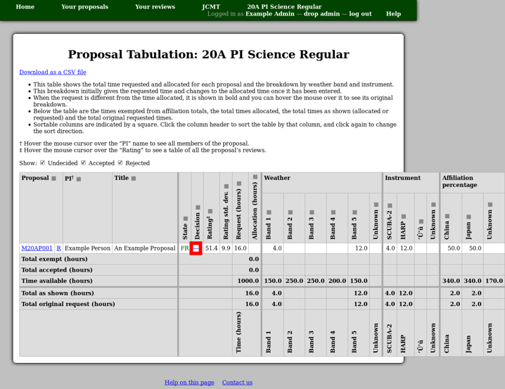
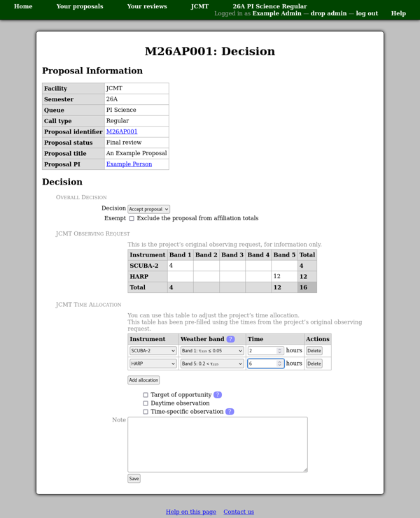

Detailed Tabulation and Decisions
=================================

The "detailed tabulation" page attempts to summarize the information
about each proposal which the committee will need in order to make
decisions regarding which proposals to accept.
You can also download a copy of the same information as a CSV file.

To enter a decision, click the entry in the "Decision" column.
(A dash is shown here until a decision is entered.)

This takes you to the decision page where there are two
main controls:

Decision
    This selection box is used to indicate whether you intend to accept the
    proposal.  You can choose to accept or reject the proposal, or
    you can select "undecided" if you do not wish to make a
    decision at the current time.

    All of the additional information is saved when you press the
    "Save" button, regardless of the decision.
    This means that you can alter a decision multiple times
    without having to re-enter the other information.
    You can also enter possible time allocations
    in advance of making decisions, should you wish to do so.

    Note that the decision will not be finalized until you
    :doc:`approve sending feedback <feedback>` to the proposal members.

Exempt
    This exempts the proposal from counting towards the affiliation
    total allocations.

    It can be used to classify "best science", or similar, proposals
    which you wish to approve regardless of affiliation.

At the bottom of the page you will see the proposal's original observing
request and a time allocation form.
You can use this to modify the observing time to be awarded.
There is also a "Note" box where you can enter any
additional information about the time allocation.
The intention is for this note to be passed to the telescope
scheduler.

Finally press the "Save" button to store both the decision and the time
allocation.

The tabulation page will then be updated to show the new allocation
rather than the original request.

.. image:: image/review_tabulation_updated.png
