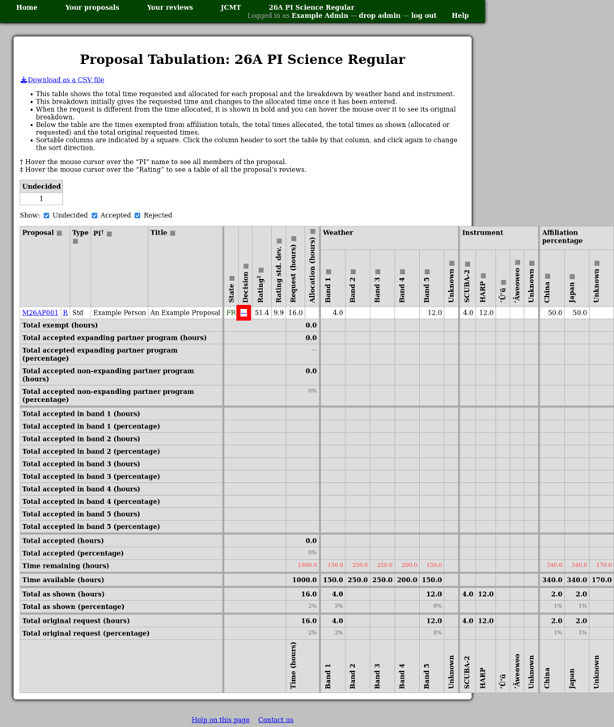
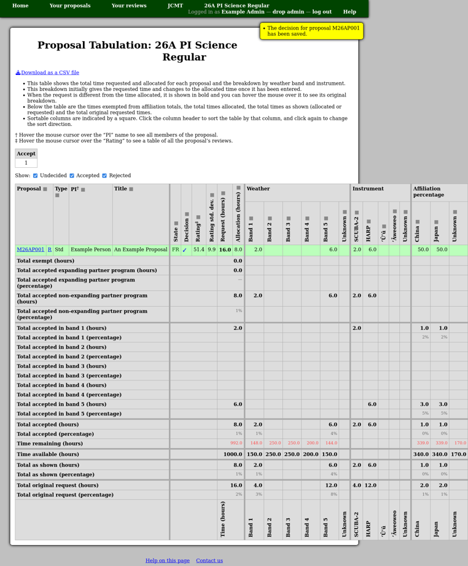

Detailed Tabulation and Decisions
=================================

The "detailed tabulation" page attempts to summarize the information
about each proposal which the committee will need in order to make
decisions regarding which proposals to accept.
You can also download a copy of the same information as a CSV file.

To enter a decision, click the entry in the "Decision" column.
(A dash is shown here until a decision is entered.)

This takes you to the decision page where there are two
main check boxes:

Accept
    This box is used to indicate whether you intend to accept the
    proposal.

    Note that the decision will not be finalized until you
    :doc:`approve sending feedback <feedback>` to the proposal members.

Exempt
    This exempts the proposal from counting towards the affiliation
    total allocations.

    It can be used to classify "best science", or similar, proposals
    which you wish to approve regardless of affiliation.

At the bottom of the page you will see the proposal's original observing
request and a time allocation form.
You can use this to modify the observing time to be awarded.

Finally press the "Save" button to store both the decision and the time
allocation.

.. image:: image/decision_edit.png

The tabulation page will the be updated to show the new allocation
rather than the original request.

