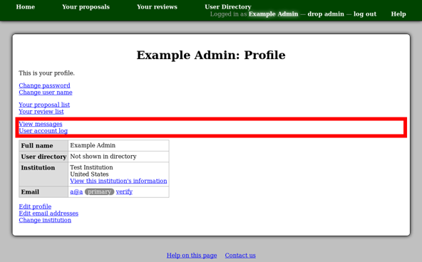
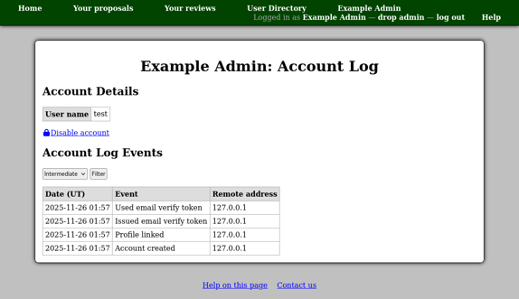
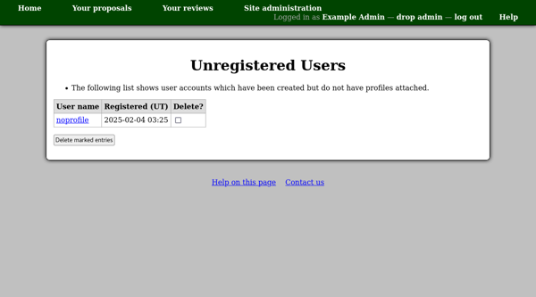

User Accounts
=============

Users with Profiles
-------------------

When logged in with administrative privileges,
you will see additional links on people's profile pages.

The "View messages" link allows you to see the
:doc:`email message list <messages>` for the particular person.

The "User account log" link shows you a log of
actions effecting the person's user account.
This page also shows the person's user account name ---
the name with which they log in.

Users without Profiles
----------------------

You can see a list of users who have not completed their registration
by creating a profile using the "Unregistered users"
link in the :doc:`site administration menu <site_menu>`.

