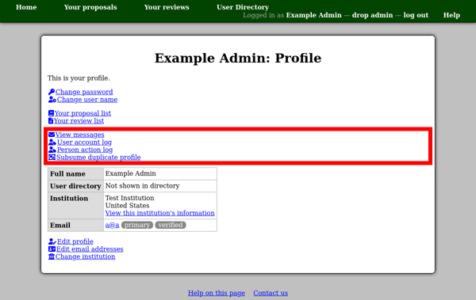
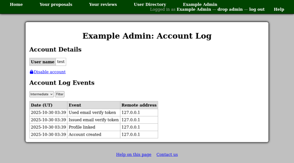
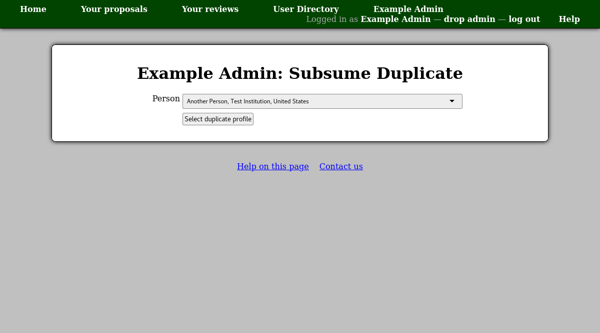
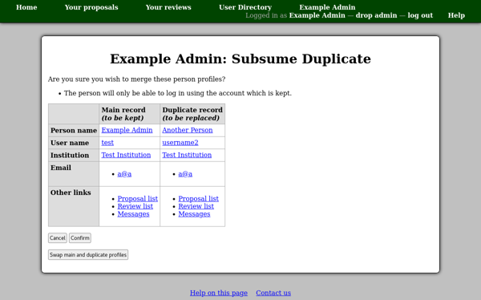
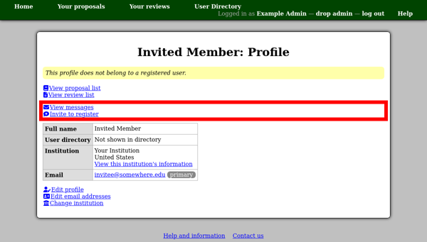
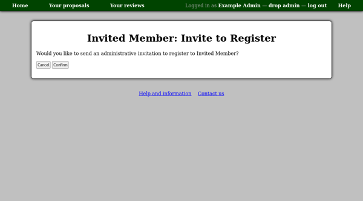

User Accounts
=============

Users with Profiles
-------------------

When logged in with administrative privileges,
you will see additional links on people's profile pages.

The "View messages" link allows you to see the
:doc:`email message list <messages>` for the particular person.

The "User account log" link shows you a log of
actions effecting the person's user account.
This page also shows the person's user account name ---
the name with which they log in.

The "Subsume duplicate profile" link can be used
to merge user accounts.

The first page allows you to select the duplicate profile.

Then a confirmation page will give details
of the profiles you are about to merge.

Users without Profiles
----------------------

You can see a list of users who have not completed their registration
by creating a profile using the "Unregistered users"
link in the :doc:`site administration menu <site_menu>`.

.. image:: image/user_unregistered.png

Unregistered People
-------------------

People who have been invited to register for an account,
but have not yet done so,
are normally not shown in the user directory.
However when logged in with administrative privileges,
you should see a control at the top of the page
allowing you to view a list of unregistered people,
or those with any registration status.

The person's profile page will include a note at the top
indicating that they are not registered.
There will also be a slightly different
set of administrative links.

If you would like to re-invite the person to register,
you can use the "invite to register" link.
After confirmation, a new invitation code will be generated
and sent by email.
This can be useful if their original code expired a long time ago.
However if whatever prompted their original invitation is still pertinent,
you can generate a more informative email message
by using the "re-send invitation" link on the corresponding page.

