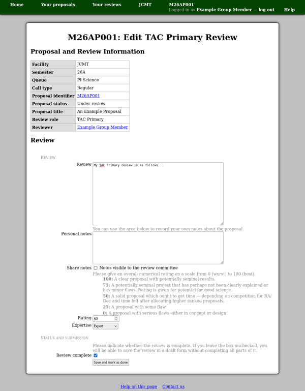

Committee Member Review
=======================

Entering a committee member review is done in the same way as
an :doc:`external review <external>`,
except that you will not normally receive an invitation from the system.
Instead please check your :doc:`review list <review_list>`
for links to the reviews which have been assigned to you.

Aside from the main review text area,
the form also contains a section where you can enter personal notes.
These will not be shown to the rest of the committee unless
you check the "share notes" box.

Finally the review form has two controls allowing you
to enter your rating of the proposal
along with your assessment of your own level of expertise in this field.
The expertise level will be used to weight your
rating when the overall rating of the proposal is calculated.

When you have completed your review,
please be sure to check the "review complete" box
before saving it.
This will mark the review as done in the system
and include your rating in the proposal's overall rating.

