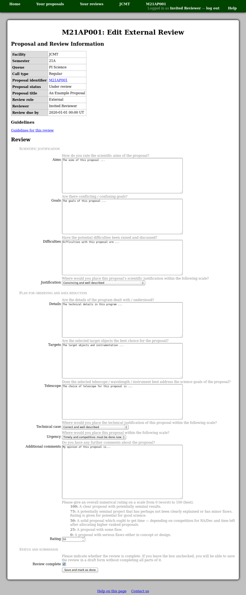

Writing an External Review
==========================

On the review editing page,
you will find a table of summary information about the
proposal to which the review relates.
Please take a moment to check that you are
entering your review for the correct proposal.
The proposal identifier is a link which you can use to view the proposal.

Below the table is the form where you may enter your review.
The exact details of this form may vary depending on the type of review,
but for an external review it will typically consist of
one or more text areas for your comments
followed by a numerical rating.

You will be able to view the proposal and return to edit
your review while the proposal remains in the "Under review" status.

Please be aware that the system will prompt you
to log in again if you have not loaded any new pages
for about twelve hours.
If this happens when you try to save your review,
log in and then use your browser's back button
(twice) to return to the review you were editing.
This procedure is expected to work in the current
versions of Firefox and Chrome and probably
other browsers too.

You may save your review and then return
to edit it again as many times as you wish while the corresponding
review process remains open.
To save a draft version of the review,
for example if you have not yet completed all of the sections,
leave the "review complete" box unchecked.
(The submission button will be labeled "save as a draft").

To complete the submission of your review,
check the "review complete" box before saving it.
(The button will be labeled "save and mark as done").

The review status will be shown as "in preparation"
on your :doc:`review list <review_list>`
when you have saved a draft version.
This will change to "done"
as soon as you have saved the review for the first time
with the "review complete" box checked.

.. toctree::
    :maxdepth: 2

    external_jcmt
