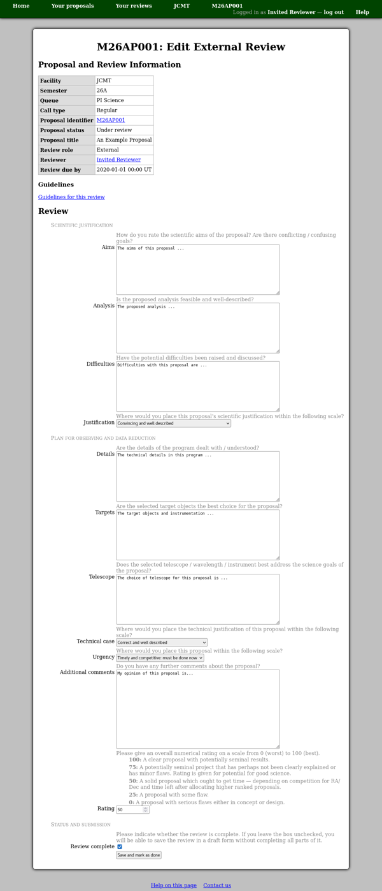

Writing an External Review
==========================

On the review editing page,
you will find a table of summary information about the
proposal to which the review relates.
Please take a moment to check that you are
entering your review for the correct proposal.
The proposal identifier is a link which you can use to view the proposal.

Below the table is the form where you may enter your review.
The exact details of this form may vary depending on the type of review,
but for an external review it will typically consist of
a text area for your comments
followed by a numerical rating.

You will be able to view the proposal and return to edit
your review while the proposal remains in the "Under review" status.

Please be aware that the system will prompt you
to log in again if you have not loaded any new pages
for about two hours.
If this happens when you try to save your review,
log in and then use your browser's back button
(twice) to return to the review you were editing.
This procedure is expected to work in the current
versions of Firefox and Chrome and probably
other browsers too.

.. toctree::
    :maxdepth: 2

    external_jcmt
