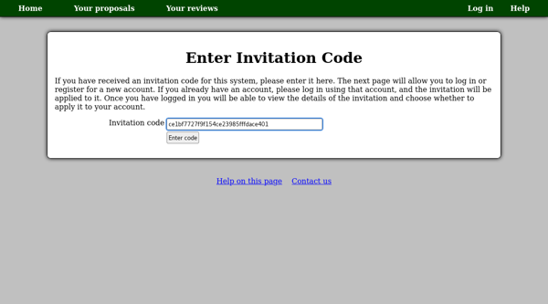
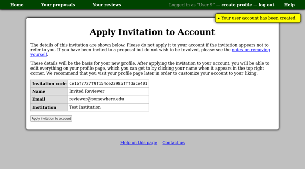
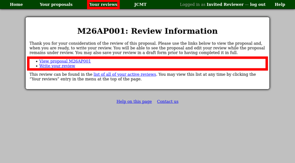

Accepting an Invitation to Review a Proposal
============================================

The process of accepting an invitation to review a proposal
is very similar to that for
:doc:`accepting a proposal membership invitation <../user/invitation>`.
Please note that this process does not apply if you were invited to
review a proposal using your existing account
--- in that case you will be able to access the proposal and
enter your review directly using the links included in
your review invitation email,
or from your :doc:`review list <review_list>`.

* If you have already registered with the system, you can add the review
  to your existing account.
* Alternatively you can use the invitation to help you register for an account.

Please see the :doc:`proposal invitation page <../user/invitation>`
for information about how to enter and accept your invitation code.

As with proposal invitations, you will have a chance to check the
details of the invitation before choosing whether to accept it.

Once you have accepted the invitation,
you should be taken to the review information page.
This gives links for viewing the proposal
and writing your review.
Note also the "Your reviews" entry in the menu at the top
of the page --- you can use this at any time to see a list
of all your active reviews.

In the event that the system can not determine which page to show you,
you will be redirected to your profile page where there are links to your
proposal and review lists.

