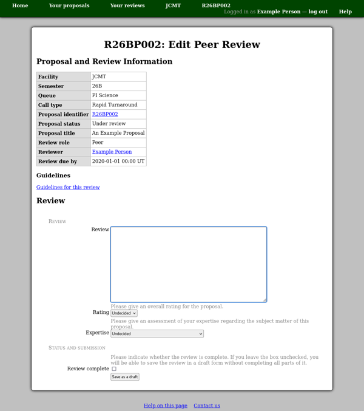

Peer Review
===========

When you have submitted a proposal for a call which uses
the peer review system,
you will be asked to review several of the other proposals
received at the same time.
Shortly after the closing date,
you should receive an email giving details of the proposals
you have been asked to review.
You can also find them listed
on your :doc:`personal review list <review_list>` page.
You will generally need to have completed all of your reviews
by the due date for your own proposal to advance
to the next stage of the review process.

You can read each of the proposals you have been asked
to review by following the link from the proposal
identifier on your :doc:`review list <review_list>`.
However before you can see each proposal or enter your review,
you will need to determine whether you can review it fairly,
or whether you would have a conflict of interest
preventing you from doing so.
You will first be shown a summary of the proposal,
including the abstract and list of members.
Please select the appropriate declaration and,
if there is a conflict of interest, enter a brief explanation.

If you are unable to review the proposal,
it will be removed from your review list.
(You may be assigned additional proposals
to review instead at a later time.)
Otherwise to enter your review,
follow the link from the review role column
on your :doc:`review list <review_list>`,
which will take you to the review editing page.
At the top of the editing page,
you will find a table of summary information about the
proposal to which the review relates.
Please take a moment to check that you are
entering your review for the correct proposal.

Below the table is the form where you may enter your review.
You can save the review and return to continue working
on it while the review process is open.
When you have finished your review,
please check the "review complete"
box at the end of the form before saving it.
(The submission button will then be labeled "save and mark as done".)

.. toctree::
    :maxdepth: 2

    peer_jcmt
