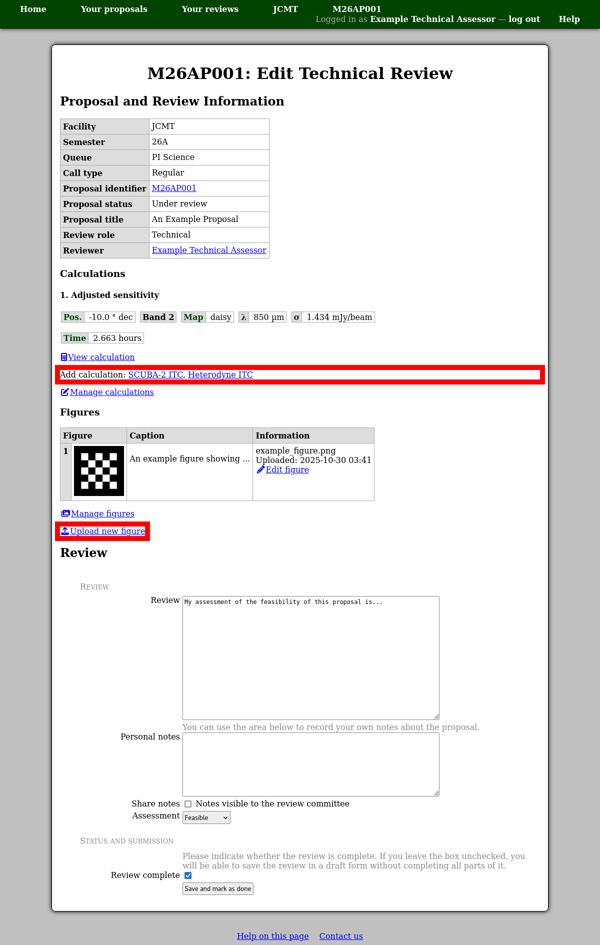
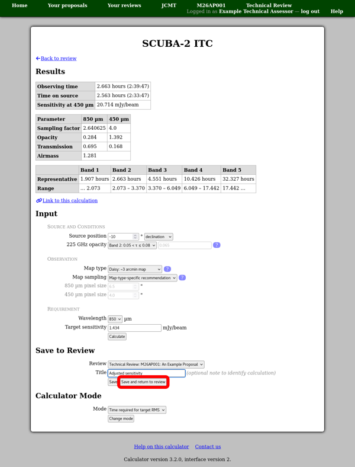
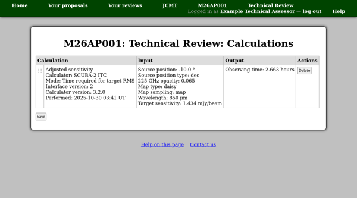

Technical Assessment
====================

Entering a technical assessment is done in the same way as
an :doc:`external review <external>`,
except that you will not normally receive an invitation from the system.
Instead please check your :doc:`review list <review_list>`
for links to the reviews which have been assigned to you.

The technical review editing page allows you to add
calculations to your review.
Please be sure to save any work in progress on the review
before following the links to the calculators.

You can attach a calculation to any suitable review by
scrolling down to the "Save to Review"
section of the calculator page.
Check that the correct review is selected
and then click the "Save" or "Save and return to review" button.

If your technical assessment has calculations attached,
these will appear at the top of the review editing page.
There you should also find a link to "manage calculations"
which takes you to a page showing detailed information
about each of the calculations.
You can use this page to reorder the calculations using
the drag "grip" in the leftmost column,
or to delete calculations using the "Delete" button.
Any changes you make here will not be saved until you
click the "Save" button.

