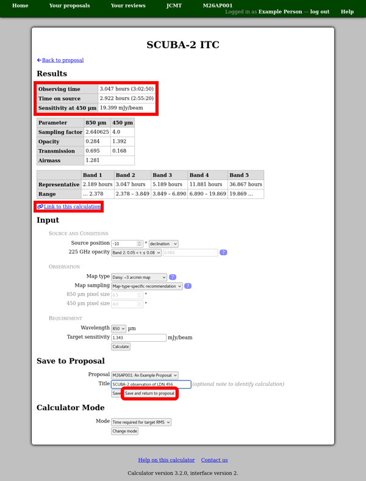
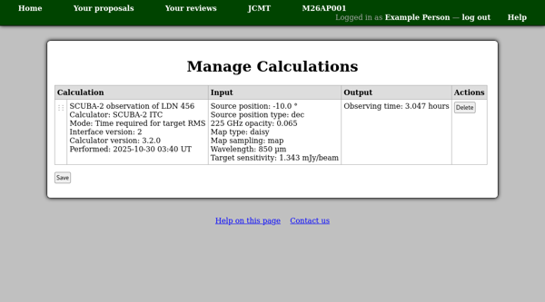

Calculations
============

This system includes built-in integration time calculators (ITCs) which
you can use to determine the time required for the observations
which you are proposing.

You can access these calculators at any time from the
"Calculators" section of the facility home page.
(They should be available even when there is no open call for proposals.)

When you are writing a proposal, you will find a section
"Calculation Results" immeditately before the technical
justification.  This section will also include links to the
available calculators.

The example below shows a calculation performed in the
SCUBA-2 ITC.
The parameters of the desired observation
-- the source position, weather band map type, target sensitivity etc. ---
have been entered in the "Input" section
and the "Calculate" button pressed to perform the calculation.

The main results are shown in the table at the top of the page,
in the "Results" section.
This can be followed by supplementary results
which may help you understand the calculation.
In the example below this includes the estimated transmission
and airmass and a table comparing the results in different weather
bands.

When you are ready to save the calculation, scroll down to the
"Save to Proposal" section towards the end of the page.
Here you should ensure the correct proposal is selected,
optionally enter a title for the calculation
and press the "Save and return to proposal" button.
Alternatively if you would like to keep using the calculator
to add more calculations to your proposal, press the plain "Save" button.

A compact version of each calculation which you have saved will
be shown on your proposal.
To see the full calculation again,
use the "View calculation" link below the calculation.
While viewing a saved calculation you have the option to
save an updated version, overwriting the previous calculation.

If you want to remove a calculation,
use the "Manage calculations" link
at the end of the "Calculation Results" section.
This takes you to a page which shows detailed information
about each calculation.
From here you can delete calculations which you no longer
want to appear on your proposal.
Any deletions which you make will not take effect until
you use the "Save" button below the table.

.. toctree::
    :maxdepth: 2

    calculation_scuba2
    calculation_jcmt_het
