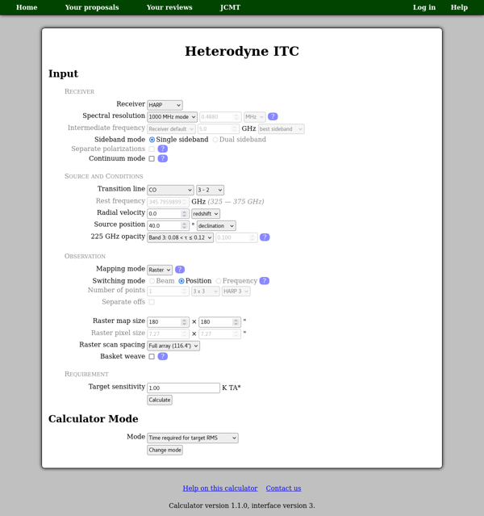

JCMT Heterodyne Integration Time Calculator
===========================================

This calculator can be used to estimate integration times for
heterodyne instruments at the
`JCMT <http://www.eaobservatory.org/jcmt/>`_.

Receiver
--------

First select the receiver you wish to use.
On the next line you should select the frequency resolution
--- please refer to the
`ACSIS <http://www.eaobservatory.org/jcmt/instrumentation/heterodyne/acsis/>`_
page for information about available resolutions.
You can also enter a lower frequency resolution if you
are planning to bin your data.
If this is given as a frequency (in MHz),
then it is the frequency resolution as observed,
i.e. the sky frequency resolution.

The "intermediate frequency" (IF) line will only be available for
newer instruments where the calculator has receiver temperature data
as a function of local oscillator (LO) frequency.
(For other instruments this input line will be disabled.)
Normally you can use the receiver default IF and the "best" sideband ---
the results will show the IF and LO frequency
which the calculator has used.
However if you wish to adjust the IF,
for example as part of a tuning for multiple simultaneous lines,
you can select "Other" from the menu and then enter the desired frequency.
Similarly you can select a specific sideband if you do not
want the "best" sideband to be selected automatically.

The current receivers each have only one sideband mode:
single, dual or sideband-separating (2SB),
so only one option will be available here.
For sideband-separating receivers,
a single-sideband calculation should be used.
Some receivers (e.g.
`ʻŪʻū and ʻĀweoweo <http://www.eaobservatory.org/jcmt/instrumentation/heterodyne/namakanui/>`_)
have two mixers observing the same position in orthogonal polarizations.
By default the calculator will assume that you intend to use both
mixers together to reduce the integration time required.
This is generally the best option, as the two polarization measurements
are insufficient for polarimetry.
However if you wish to estimate the sensitivity which would
be obtained in each polarization individually,
you should select the "Separate polarizations" option.

You may select "Continuum mode" if it is required for your observations.

Source and Conditions
---------------------

In the source and conditions section, you should select
the transition line which you wish to observe.
This is done using two controls to select the
species first and then the transition.
Transitions which fall outside the receiver's tuning
range will be disabled.
Therefore if your source has a significant radial velocity,
you should enter that first.
The redshift you select, or the velocity converted to a redshift,
will be applied to the receiver's tuning range,
which is shown next to the rest frequency input box.
The set of enabled transition lines will also be updated
for the given redshift.

If you wish to observe a transition line which is not listed,
you may enter the frequency manually.
To do this, select "Other" from the top of the list of species
(the first box for the input labeled "transition line").
You will then be able to enter the frequency manually
in the "rest frequency" box.
The frequency should be within the receiver's tuning range,
which is shown beside the input box.
Note that this is the rest frequency taking into account
the radial velocity.
(If the radial velocity is not zero, the observed frequency
will be computed as part of the calculation.)
If you are saving the calculation to your proposal
and using a manually-entered frequency,
it is helpful to include in your technical justification
an explanation of which transition lines you propose
to observe.

You can either enter the declination of the source or give
an elevation or zenith angle.
If you enter the declination then the zenith angle
will be estimated as

.. math::
    angle_{zenith} = \cos^{-1}( 0.9 * \cos( dec - 19.823 ) )

where 19.823 is the latitude of the JCMT,
and the factor 0.9 is an approximation
for the average zenith angle of the source.

For the weather conditions you can either select one of the
`JCMT weather bands <http://www.eaobservatory.org/jcmt/observing/weather-bands/>`_,
in which case a representative value for that band will be used,
or select "Other" and enter a 225 GHz opacity value directly.
The calculator uses a tabulated atmospheric model to estimate the
opacity at the frequency which you have selected.

Observation
-----------

In the "Observation" section you define the type of observation
which you wish to make.

* **Mapping mode**

  Raster mapping
    Data are recorded on-the-fly while the telescope scans an area.
    For producing large maps,
    raster mapping is often the most efficient method with only one off-source
    reference taken per scan line.
    If you select this option you need to
    enter the size of your map.

  Jiggle mapping
    The secondary mirror of the telescope moves in a pre-defined pattern.
    Making small maps which fit within the jiggle pattern
    is often most efficient using this mode.
    If you select this option you will need to select a jiggle
    pattern, which controls the number of points being observed.

  Grid mapping
    The telescope moves to one or more individual points.
    In this mode you should enter the number of map points
    directly.  This can just be one point if you intend to perform a
    single-position "stare" observation.

* **Switching mode**

  Beam switching
    The secondary mirror of the telescope "chops"
    a short distance (<= 180 arc-seconds) to either side.
    Beam switching produces better baselines than position switching
    but requires little or no emission close to the target due
    to the limited "chop" distance".

  Position switching
    The whole telescope moves between the source and offset position.
    Will generally produce flat baselines.

  Frequency switching
    The observing frequency alternates during the observation
    so there is no need for a separate "off" position.
    This can produce wavy baselines that will
    not be suitable when wide lines are being observed.
    *Frequency switching is not currently supported by this calculator.*

Please see the
`heterodyne observing modes <http://www.eaobservatory.org/jcmt/instrumentation/heterodyne/observing-modes/>`_
page for more information about these modes.

Requirement
-----------

The calculator has three modes:

Time required for target RMS
  In this mode you can enter your desired sensitivity
  (:math:`1 \sigma` RMS :math:`T_A*`).
  The calculator will determine the "integration time"
  required per point in your map and from this calculate the
  total "elapsed" time required to perform the requested observation.

RMS expected in elapsed time
  If you would like to start with the total "elapsed" time available
  for the observation, you should use this mode.
  The calculator will determine the corresponding "integration time"
  per point and then estimate the sensitivity.

RMS for integration time per point
  If you want to specify the "integration time" per point,
  select this mode.
  The calculator will determine the time required to complete the
  whole observation and an estimate of the sensitivity achievable.

You can change calculation mode by selecting the desired mode
in the "Calculator Mode" section and pressing the "Change mode"
button.
The calculator will attempt to adjust your inputs to
do the same calculation in the new mode.

