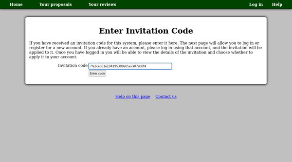
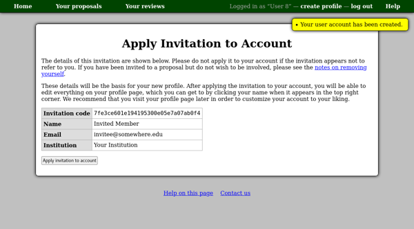

Accepting an Invitation
=======================

If someone adds you to their proposal, you may receive
an invitation code by email.
This code can be used in two ways:

* If you do not already have an account, you can register for a new
  account, making use of the information already entered for you.

* Otherwise, you will be able to add the
  new proposal to your existing account.

You may begin by using the link in the invitation email,
or by clicking the "Enter an invitation code" link on the home page.
Copy and paste the code into the box and
press the "Enter code" button.

Next, if you are not already logged in, you will be prompted
to log in or register for an account.
If you do not yet have an account, click the "register" link.
You will only be required to complete the first step,
choosing a user name and password,
as most of the necessary information will already have
been entered by the person who invited you to their proposal.

Then you will see a page giving the details of the invitation
you have received.
Don't worry if the details aren't quite right --- you will be
able to edit your profile after accepting the invitation.
Press the "Accept invitation" button to continue.

The next page you see will depend on the details of the
invitation you received:

* If the person who invited you did not enter your institution,
  you will be asked to select it now.

* Otherwise you should be taken directly to the proposal view page.

* If the system can not determine which proposal to show you,
  you will be redirected to your proposal list.
  This will list all the proposals of which you are a member.

Removing Yourself from a Proposal
---------------------------------

If you find that you have been added as a member of a proposal
with which you do not wish to be involved,
you can remove yourself as follows:

1. Accept the invitation normally as described above.

2. Go to the proposal view page.  Normally you will be redirected
   to this page on accepting an invitation --- otherwise you can
   find it from the "Your proposals" page.

3. You can then read the proposal to ensure you do not wish to
   remain part of it.

4. Scroll down to the "Members" section and click the link
   "Remove yourself from this proposal".

5. On the next page you will be asked to confirm your removal from
   the proposal.  Once you click "Confirm" you will be
   removed from the proposal and taken back to the main home page.
