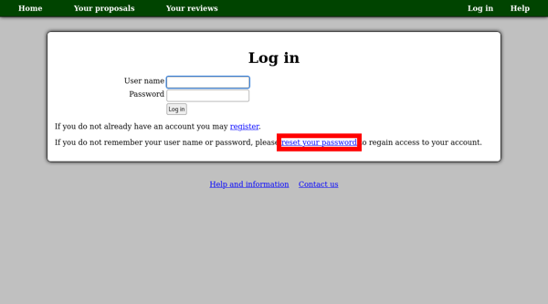
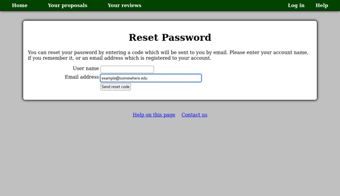
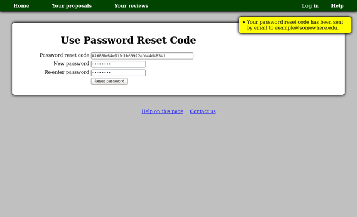

Forgotten Password or User Name
===============================

If you forget your user name or password,
please use the "reset your password"
link on the "Log in" page.

On the next page,
enter your user name, email address or both.
If you enter an email address, your password
reset code will be sent to that address.
Otherwise it will be sent to your primary address.

If you do not not remember any of your account information,
or no longer have access to the email address which you used to
register, please contact us as we may be able to help you
recover your account.
This is preferable to making a new account as it will ensure
you have access to all of your proposals from a single account.

Once you receive the reset code,
you can enter it and select a new password.
After doing this, you will be taken back to the
"Log in" page where your user name will have
been filled in for you in case it also was forgotten.

