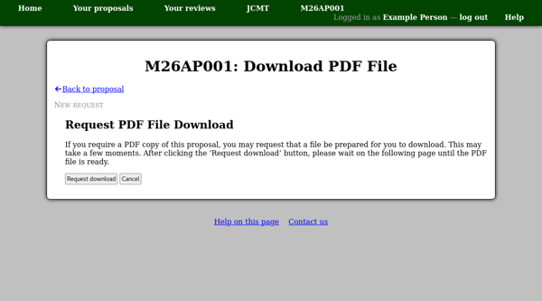

The Completed Proposal
======================

Your completed proposal should end up looking something
like the example below.
(But of course with a lot more detail filled in!)

Things to check include:

* The **proposal status** in the table at the top of the page:
  this should now show **"Submitted"**.
* There should be **no red boxes** (indicating warnings)
  and ideally no yellow boxes (indicating missing sections).

.. image:: image/proposal_complete.png

Requesting a PDF File Download
------------------------------

If you require a copy of your proposal as a PDF file,
you can use the "Request PDF file download"
link near the top of the proposal page to request one be prepared for you.
This will take you to a page where you can confirm your request.

Your request will be queued until the system is able to prepare
the proposal PDF file.
This can take some time.
The request status page will refresh every few seconds to show
the status of your request.
As soon as the PDF file is ready,
your browser will be redirected to download it.
If instead an error occurs while the file is being prepared,
the "Request status" box will be updated to indicate this,
and the page will stop refreshing.
Once the PDF file has been prepared,
it will be available for a limited time before the request expires.

Saving Directly as a PDF File
-----------------------------

As a quicker method to save your proposal as a PDF file,
many systems offer the ability to print to a PDF file from your web browser.
Printing the proposal view page should produce a sensible version
of the proposal (without the menu bar and navigation links).

* Using **Google Chrome**

  With recent versions of Chrome, on the "Print" panel,
  you can select "Save as PDF" in the "Destination" section.

* With **Linux** systems

  Assuming your system uses CUPS,
  you should be able to print to PDF but you
  may need to add the "CUPS PDF Printer" first.
  You can do this via the CUPS web interface ("Add Printer" button)
  or through the settings application.
  You may first need to install the corresponding software package
  --- this may be called "cups-pdf" or "printer-driver-cups-pdf"
  depending on your Linux distribution.

* With **macOS**

  There is normally an option to save as PDF in the lower left corner
  of the print dialog box.

* With **Windows 10**

  You should be able to save a PDF file by
  selecting "Microsoft Print to PDF" as your printer.
