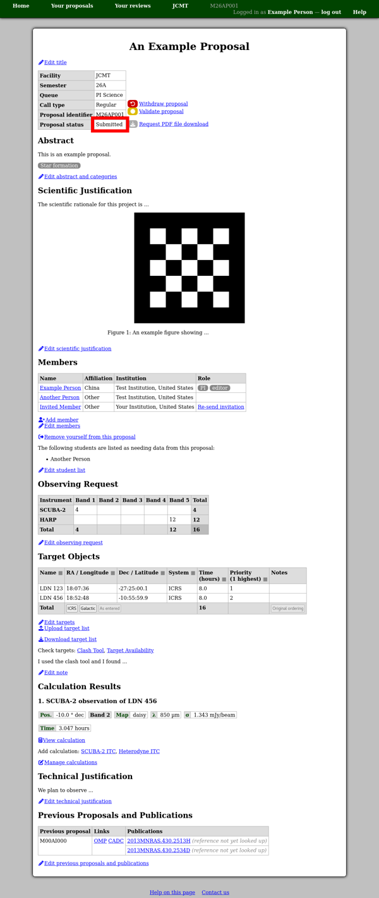

The Completed Proposal
======================

Your completed proposal should end up looking something
like the example below.
(But of course with a lot more detail filled in!)

Things to check include:

* The **proposal status** in the table at the top of the page:
  this should now show **"Submitted"**.
* There should be **no red boxes** (indicating warnings)
  and ideally no yellow boxes (indicating missing sections).

Note that there is not (yet) a way to download a PDF file of your
whole proposal.
In the meantime, many systems offer the ability to print to a PDF file.
Printing the proposal view page should produce a sensible version
of the proposal (without the menu bar and navigation links),
so you should be able to use this to save a copy of the proposal
from your web browser.

