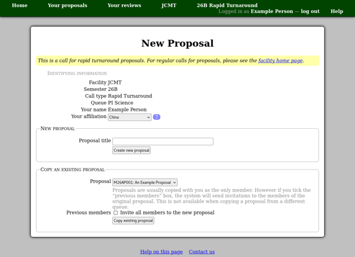

Copying a Proposal
==================

When you next wish to create a proposal,
the `"New Proposal" <proposal_create>`_ page
may offer the option to copy an existing proposal.

Please check that the identifying information in the first section
of the page is correct and select your current affiliation here.

Then continue to the third section, labeled "copy an existing proposal".
You do not need to enter the title
--- it will be copied from the previous proposal.
Select the proposal which you would like to copy.

By default you would be the only member of the new proposal,
but if you are creating a copy for a call in the same queue,
you may have the option to automatically invite
all of the members to the new proposal.
Note that this will cause the system to send each member
an email message, inviting them to the proposal.
If you only wish to include some of the members,
please do not select this option.
Instead you can invite those members who are still involved with your project
once you have finished copying the proposal.

Finally click the "Copy existing proposal" button to create a copy.

Since copying a proposal can be somewhat time-consuming,
your request will be queued for processing.
The next page will refresh every few seconds
to show the current status of your copy request.
As soon as your copied proposal is ready,
you should be taken to the new version.
However if a serious error in copying occurs,
this will be shown as the "Request status",
and the status page will stop refreshing.

The copying process goes through your proposal section by section
and attempts to ensure that all of the information is still
valid for the current call for proposals.
Some information may be automatically updated
and other information may have to be removed,
for example if the requirements for this call are substantially
different from those of the call for which the original proposal
was submitted.

The first time you view your proposal,
a "Copy Report" should be shown just below the title.
This will list all of the sections which were copied,
along with various notes about the contents of each section.
Please read this section carefully to understand
which parts of your proposal may have been changed or omitted.

