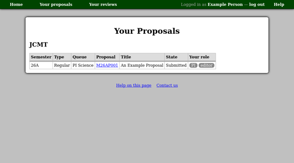
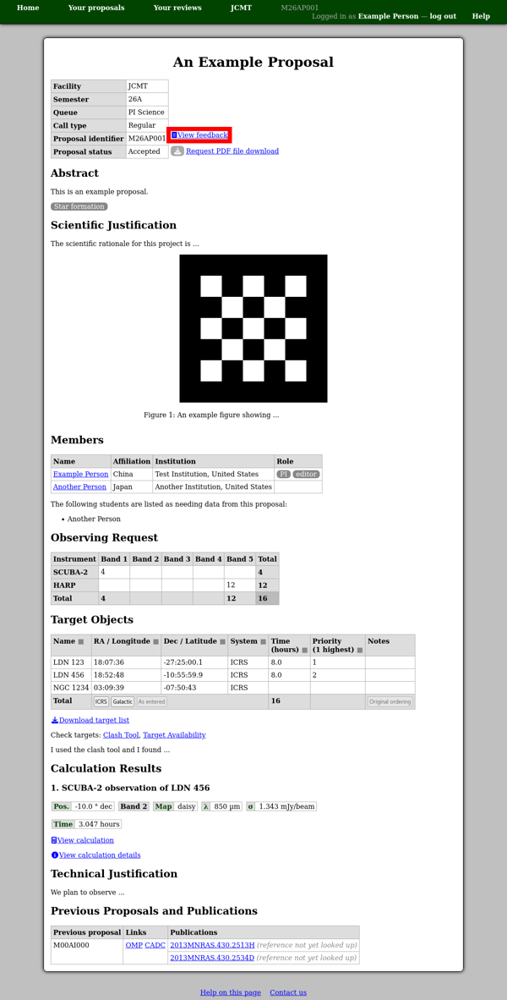
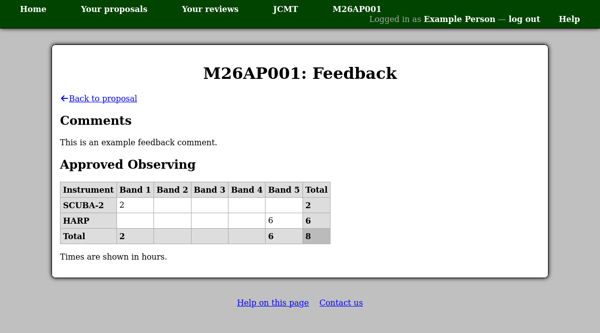

Your Proposal List
==================

Your proposal list contains all the proposals of
which you are a member.
You can use the list to navigate back to proposals
which you are preparing,
as well as using it to view proposals you have
previously submitted through this system.

To visit your proposal list, click the "Your proposals" link
in the menu bar at the top of any page.
If you are not already logged in, you will be prompted
to enter your user name and password before
being taken to the list.

If you view a proposal after the review process is complete you will
see a feedback link next to the status.

This link takes you to a page showing any comments from
the Time Allocation Committee
as well as information about the observing time approved.
This should be the same information which would have
been sent to you via email at the end of the review process.

