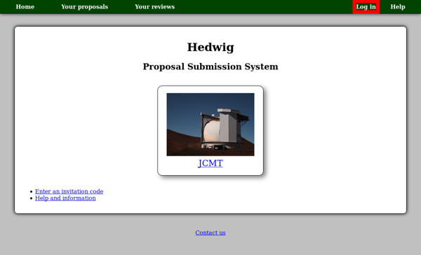
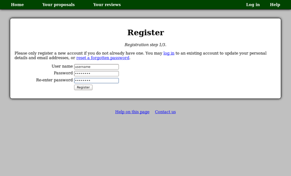
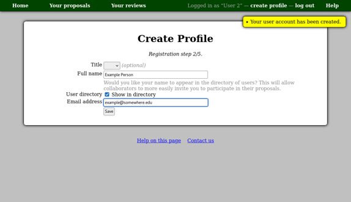
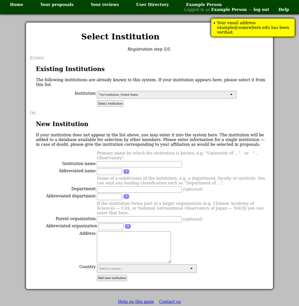
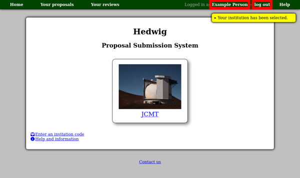
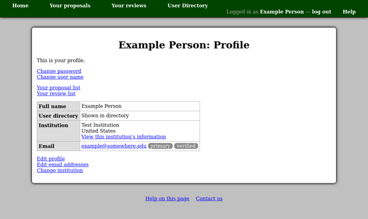

Creating an Account
===================

Before you can begin writing a proposal, you will need to create
an account.  Click the "Log in" link at the top right and
then click the "register" link.

You should now see the new-user registration page.  Enter the user
name which you would like to use to log in to the system and
a password.

On the next page, notice the yellow box at the top right.  When this
box appears it will indicate an action which has been performed.
In this case it confirms that your user name and password have been
set up.

This page allows you to configure your profile --- this is your personal
information which will be attached to any proposal of which you are a member.
You have the option of being shown in the user directory or not.
If you choose to show your profile in the directory, it will allow your
collaborators to automatically give you access to proposals which they create.
Otherwise you will be sent an invitation code by email if anyone wants
to add you as a member of a proposal.

By default, your email address is not shown on your profile, even
if your profile is shown in the user directory.  You can configure
these settings at any time from your profile page.

Please note that you will not be able to use the password reset
system to recover a lost password until you have entered an
email address.
Please contact us if you lose your password at this stage
as we may be able to help you recover your account.
We may also remove accounts left in this state if they are
inactive for a long time.

Finally you should select the institution with which you are
affiliated.  Please check the menu of institutions which are
already known to the system.  If your institution appears here,
please select it, and press the "Select institution" button.

If your institution does not appear, you may enter the
institution's details in the "New Institution" section
of the page and press the "Add new institution" button.
The "Institution name" should be the main name by which
you refer to the institution.  This is often the name
of the university (e.g. University of Exeter) or
observatory (e.g. Purple Mountain Observatory)
but is sometimes the name of a specific institute
(e.g. Harvard-Smithsonian Center for Astrophysics)
when it is often used alone.
The department and parent organization are optional.
Please be sure to select the correct country from the list.

This completes the registration process.  You should be taken back to the
home page.

Note your name and the "log out" link at the top right of the page.
This serves as a reminder that you are logged in.  Don't forget
to log out when you are done using this system if someone else
may have access to your computer.  Your session will automatically
time out after two hours of inactivity --- you will be prompted to
log in again in this case.

The link showing your name will take you to your profile page.
You may use this page at any time to manage your account,
for example you can:

* Change your user name or password.
* Add, change or remove email addresses.
* Change your institution.

Note that you can configure multiple email addresses and designate one of
them as your primary address.  Messages sent by the system will generally
be sent to your primary address.

As we have already seen, this system maintains a shared list of
institutions which people can select for their profile.
Please be aware of the different ways you can change your institution:

* If you have moved to a different institution, please click the
  "Change institution" link on your profile.  This will allow you
  to select another institution or enter its details.

* If something is wrong with your current institution (perhaps the
  address has changed or the name is spelled incorrectly) then
  you can click on the institution's name on your profile
  and then click "Edit this institution".   This will update the
  institution record for everyone using it.

For more information about your profile, please see the
:doc:`profile <profile>` page in the
:doc:`account management <account>` section of this documentation.
