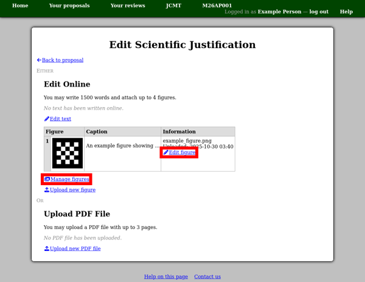
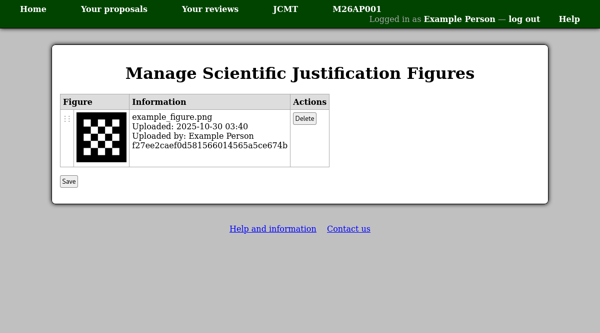

The Scientific Justification
============================

From the "Scientific Justification" section of your proposal,
the "Edit scientific justification" link will take you to
a page allowing you to manage this part of the proposal.
When you have finished editing it, you can return to your
proposal using the "Back to proposal" link,
or by clicking your proposal code in the menu bar
at the top of the page.

The page will normally offer the choice of editing the
text of the technical justification online,
or uploading a PDF file.
Note that this is an either/or choice:
if you choose to edit text online having uploaded a PDF file,
your PDF file will be removed, and vice-versa.
You will probably find a link allowing you
to upload figures to go with your text.
This only applies if you are editing text
online --- if you plan to upload a PDF file,
include your figures in the file instead
of uploading them here.

If you plan to edit the text online,
use the figure upload link to upload new figures.
The types of figures which the system is able to
process are listed at the top of the page.
You may enter a caption for the figure
as well as choosing the file to upload.

Back on the "Edit Scientific Justification" page,
your figure will initially be shown as
"Not yet processed".
You can continue working on the proposal while waiting
for the figure to be processed.
If you refresh the page later, you should see a
small version of your figure.
There will be a link labeled "Edit figure"
if you would like to change the caption
or replace the figure with a new file.
You can use the "Manage figures" link if you would
like to remove a figure.

The figure management page shows a table with some information
about each figure which you have uploaded.
To remove a figure, click the "Delete" button next to it,
and then press the "Save" button below the table.

You can also change the order in which your figures appear by
rearranging the rows of the table.
To do this, drag the table row's "grip" in the leftmost column
and drop it onto the row after which it should appear.

When you edit the text of your scientific justification,
the figures, along with their numbers, will be shown
below the text box for reference.

**Please save your work frequently!**
You can save the text as often as you like
--- using the "Save" button below the text box ---
and return to this page.
Please be aware that the system will prompt you
to log in again if you have not loaded any new pages
for about twelve hours.
If this happens when you try to save your text,
log in and then use your browser's back button
(twice) to return to the text you were editing.
This procedure is expected to work in the current
versions of Firefox and Chrome and probably
other browsers too.

There is an estimated word counter next to the "Save" button.
As always, the server will double-check the word count when you
save the text and may produce a slightly different count.
If this leads to the error that the "Scientific justification is too long"
then you will need to remove a few words before you can save the text.

.. image:: image/sci_case_text.png
