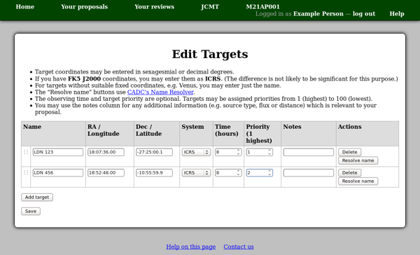
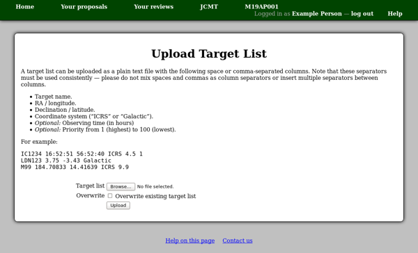
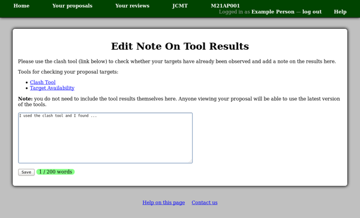

Target Objects
==============

To open the target object list editor,
click the "Edit targets" link in the "Target Objects"
section of your proposal.

You can use the "Add target" button to add as many rows
to the table as necessary.
The "Delete" button removes rows from the table,
but as always, your changes on this page are not
saved until you press the "Save" button at the bottom of the page.

You can change the order of your list of targets by
rearranging the rows of the table.
To do this, drag the target's "grip" in the leftmost column
and drop it onto the row below which it should appear.

The "Resolve name" button can be used to attempt to determine the
coordinates of an object from its name using CADC's Name Resolver.
If successful the RA and Dec columns will then be filled in for you,
otherwise you will need to enter these yourself.

Note also the "Time" and "Priority" columns.
These columns are useful for helping
the Time Allocation Committee to understand your proposal.
For example, if insufficient time is available for your
proposal to be accepted in its entirety,
the committee may be able to use the target priority information
to award sufficient time for a subset of your proposed project.

Uploading a list of Targets
---------------------------

As an alternative to entering target coordinates online,
you can upload a list as a text file (space or comma-separated).
The required format is explained on the upload page,
which you can reach using the "Upload target list"
link on your proposal.

Be sure to check or un-check the "Overwrite" option depending on
whether you want to replace any existing targets
(overwrite checked) or add targets to your existing list
(overwrite un-checked).

Checking your Targets
---------------------

Once you have a list of targets attached to your proposal,
you can use the target tools integrated into the system to check them.
For example, you can use the
`Clash Tool <target_clash>`_ to search for matches
against defined areas of the sky.
To use this tool, select
"Check targets: Clash Tool" in the "Target Objects"
section of your proposal.

There is an area on your proposal where you can enter notes on the
results of the tools,
which is especially useful for discussing the output of the Clash Tool.
When you have added a list of target objects,
you will see a link "Edit note" in the "Target Objects" section
of the proposal.
Anyone viewing your proposal will be able to use the latest version
of the target tools to check the target coordinates,
so you do not need to include the result of the tool here.
You should just include your comments about the results
--- this could be as simple as
"The clash tool did not find any matches"
if that is the case.

This note is particularly important when clashes are found ---
you can use this space to explain why you still need to observe
the corresponding targets.

.. toctree::
    :maxdepth: 2

    target_clash
    target_avail
