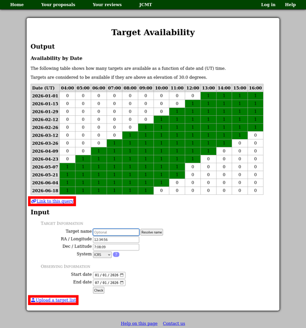

Target Availability
-------------------

Another tool which you can use to check your target objects
is the "Target Availability" tool,
which determines when during the semester they will be observable.
To use this tool, select
"Check targets: Target Availability" in the "Target Objects"
section of your proposal.
When used in this way,
the tool will automatically check a range of dates
throughout the semester to which your proposal relates.

This tool shows two tables:

Availability by Date
    This table shows a series of times through a typical observing night
    and a series of dates through the semester.

    Each cell in the table indicates how many of your targets
    are observable at that date and time.

Availability by Target
    This table only appears if you have multiple targets.

    For each target, it shows approximately for
    how much of the time during the semester that target is available.
    This can allow you to identify targets for which
    a different semester might be a better choice.

You can access the Target Availability Tool at any time from the
"Target Tools" section of the facility home page.
You can either enter a single set of coordinates,
or check multiple targets at once by following the
"Upload a target list" link.
When you use the tool in one of these modes,
you can enter the range of dates in which you are interested.

When you check a single set of coordinates,
you should see a link to the current query below the results.
This link encodes the coordinates and date range
which you have entered.
You can use it to bookmark or share the query.

