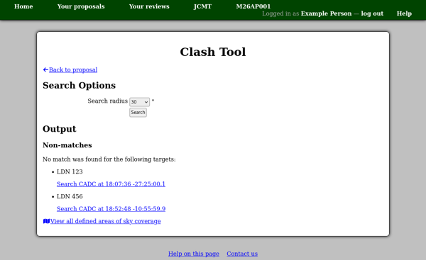

Clash Tool
----------

The Clash Tool allows you to compare target coordinates with
a set of pre-defined areas of the sky.
If you follow the
"Check targets: Clash Tool" link in the "Target Objects"
section of your proposal,
the tool will automatically perform a search using
the coordinates of all the targets listed there.

You should see a list of "Matches"
(your target objects which coincided with one of the defined sky areas)
and "Non-matches" (your target objects for which no search results were found).
In the case of a match, you can click on the name of the area
to see a description of it.
If you would like to see a list of the searches being performed
by the Clash tool,
then below the results, you should find a link to
"View all defined areas of sky coverage".

The Clash Tool allows you to select a "search radius"
to be applied around each of your target coordinates.
It should report a match whenever a circle of this radius
intersects with a pre-defined clash area.
Typically you should set this to match the size
of your proposed observations.
Note that this can result in matches being reported
when there is a significant separation between the
centers of the fields involved if they are large.
In case of doubt about a match,
it is recommended that you check the data available
in the archive to see whether your target
really has already been covered, and if so,
to what depth and at which frequencies.

A warning will be shown if the Clash Tool is in the process of being updated.
If you see this warning, please be aware that the search results
may be incomplete ---
it is recommended that you return to the Clash Tool later to
repeat your search.

You can access the Clash Tool at any time from the
"Target Tools" section of the facility home page.
You can either enter a single set of coordinates,
or check multiple targets at once by following the
"Upload a target list" link.

When you check a single set of coordinates,
you should see a link to the current query below the results.
This link encodes the coordinates and search radius
which you have entered.
You can use it to bookmark or share the search.

