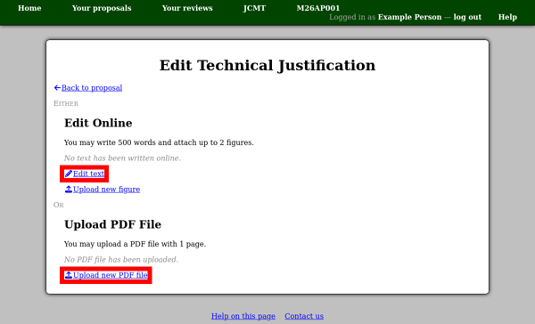
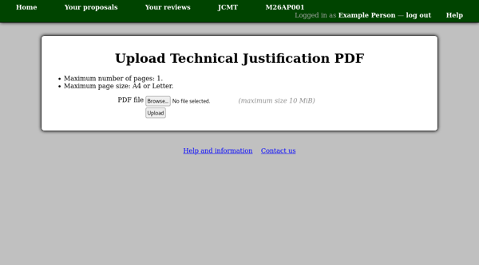

The Technical Justification
===========================

From the "Technical Justification" section of your proposal,
the "Edit technical justification" link will take you to
a page allowing you to manage this part of the proposal.
When you have finished editing it, you can return to your
proposal using the "Back to proposal" link,
or by clicking your proposal code in the menu bar
at the top of the page.

The page will normally offer the choice of editing the
text of the technical justification online,
or uploading a PDF file.
Note that this is an either/or choice:
if you choose to edit text online having uploaded a PDF file,
your PDF file will be removed, and vice-versa.

Note that this page shows the word and page limits which
apply to text written online and uploaded PDF files
respectively.

If you choose to upload a PDF file, simply select the
file and press the "Upload button".
You will be taken back to the technical justification
page which will probably show you that your PDF file
has not yet been processed.

You can continue working on the rest of your proposal
while waiting for your PDF file to be processed.
When it is ready, an image of each page of the file
will appear on your main proposal page,
allowing you and the other proposal members to view it.

When a PDF file has been uploaded,
you will see that the section regarding editing text
online is greyed out to indicate that the other
option has been used.

Alternatively if you choose to edit the text online,
you will see a page with a large text box.
In many browsers you can change the size of this box
by dragging a handle in the lower right corner.

**Please save your work frequently!**
You can save the text as often as you like
--- using the "Save" button below the text box ---
and return to this page.
Please be aware that the system will prompt you
to log in again if you have not loaded any new pages
for about two hours.
If this happens when you try to save your text,
log in and then use your browser's back button
(twice) to return to the text you were editing.
This procedure is expected to work in the current
versions of Firefox and Chrome and probably
other browsers too.

Note the estimated word counter next to the "Save" button.
This works in the same way as the counter on the
abstract page: it shows a running estimate but the server
will also check the word count when you save the text.

If you have attached calculations to your proposal,
these will be shown at the bottom of the page
in case you wish to refer to them.

